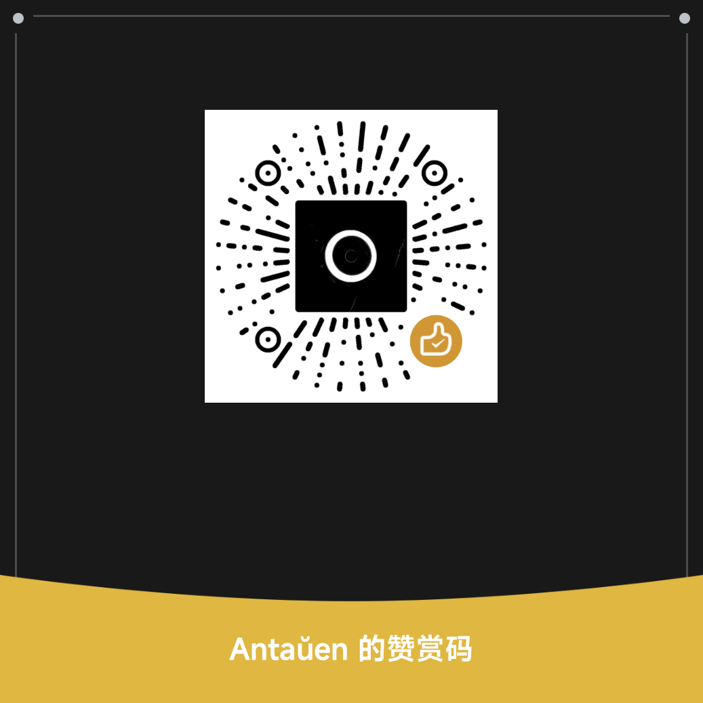

<!--suppress ALL -->

<h1 align="center">Halcyon</h1>

<p align="center">
  <b>一款贴近 MIUI / HyperOS 体验的 Android 音乐播放器</b>
</p>

<p align="center">
  <a href="https://github.com/Kifranei/Halcyon/releases"></a>
  <a href="https://github.com/Kifranei/Halcyon/releases"></a>
  <a href="https://github.com/Kifranei/Halcyon/commits"></a>
  <a href="https://github.com/Kifranei/Halcyon/blob/main/LICENSE"></a>
  <a href="README_en.md"></a>
</p>

<p align="center">
  <a href="https://qm.qq.com/q/6MHSXRrjTq"></a>
  <!-- <a href="https://t.me/halcyonplayer"></a> -->
</p>

<p align="center">
  <b>本地音乐 · 在线曲库 · 动态播放页 · 逐字歌词 · 桌面歌词 · 状态栏歌词 · 多语言界面</b>
</p>

---

## ✨ 项目简介

**Halcyon** 是一款基于 **Jetpack Compose、Miuix 和 AndroidX Media3** 构建的 Android 本地音乐播放器。

它以本地音乐和歌词体验为核心，提供 MIUI / HyperOS 风格界面、逐字歌词、桌面歌词、状态栏歌词、动态封面、应用内均衡器、Monet 动态取色、在线歌词匹配、WebDAV / Navidrome / Emby 远程曲库、LX Music API 在线音源、音乐库统计、完整应用数据备份和高度可定制的播放页体验。

---

## 🚀 功能特性

### 🎵 音乐库与歌单

- 支持本地媒体库与自定义文件夹扫描，提供专辑、艺术家、文件夹、流派、年份、作曲家和作词家等多维度浏览；长按扫描按钮可触发完整读取标签的重扫。
- 提供独立音乐库搜索页，支持歌曲、专辑、歌手、歌词、重复歌曲和全标签搜索，支持搜索历史、批量选择和范围选择。
- 支持本地歌单、收藏歌单、五星歌曲、歌单导入 / 导出、桌面快捷方式和自定义拖拽排序。
- 专辑识别会同时考虑专辑名与专辑艺术家，避免不同艺术家的同名专辑互相合并。
- 支持音乐库统计分析、听歌日历、播放次数排行、听歌时长排行、格式分布和音质分布。
- 音乐库分析支持缓存与扫描后预热，较大的本地曲库也能更快打开统计页面。

### 🖼 播放页与动态封面

- 提供沉浸式歌词页、横屏歌词页和横屏多封面展示页。
- 支持动态视频封面，可按歌曲、专辑或全局 fallback 匹配视频封面。
- 支持全局自定义壁纸、开屏海报、自定义 Hi-Res 标识和播放页按钮轮廓。
- 支持 Beautiful Lyrics 风格动态背景，可应用于歌词页、平板横屏播放页和横屏封面页，并提供速度、模糊和亮度调节。
- 支持 Monet 动态取色，可从系统壁纸或当前歌曲封面生成全局强调色。
- 非沉浸播放页可为 Hi-Res / MQ 音质歌曲显示封面角标。
- 播放页支持跟手下拉关闭、动态背景、模糊背景、封面左右滑切歌和横屏队列封面切换；平板横屏可在底部播放条和紧凑导航条显示当前歌词。

### 🎤 歌词体验

- 支持 LRC、增强 LRC、ELRC、TTML、AMLL TTML 和 Lyricify 歌词解析。
- 支持逐字 / 逐词歌词、翻译、罗马音 / 注音、背景人声、TTML 对唱和 ELRC V1/V2 对唱。
- 支持外置歌词和内嵌歌词读取，并可从同名 `.lrc`、`.ttml`、`.elrc` 文件自动匹配。
- 支持本地歌曲在线匹配歌词：基于 Lyrico 兼容插件，可从 zip 合集导入 / 删除歌词源插件，支持插件配置，匹配结果可写入内嵌标签、`TTMLLYRIC` 标签或 `.lrc`。
- 提供桌面歌词悬浮窗、状态栏歌词、媒体通知歌词、词幕、SuperLyricApi 和 Lyric Getter API 集成。
- 支持歌词卡片分享、字体导入与系统字体选择器、歌词偏移、歌词点击跳转和副行内容配置。

### 🌐 WebDAV、Navidrome、Emby 与 LX 在线音乐

- 支持 WebDAV 远程曲库，提供连接测试、Digest 认证、远程目录浏览和远程音频播放。
- 支持 Navidrome / Subsonic 与 Emby 音乐库入口，使用和 WebDAV 一致的目录浏览式体验。
- 支持 LX Music API 音源导入、在线搜索、在线播放、封面 / 歌词获取和下载到本地。

### 🎚 音效、解码、标签与音质

- 提供应用内软件 10 段参数均衡器，不依赖系统 Equalizer，并根据设备能力显示低音增强和虚拟化选项。
- 本地音频标签读取使用 lyrico-audiotag 主路径，支持常见音频格式的封面、基础标签、内嵌歌词和多值标签读取。
- 内置标签编辑器支持编辑基础标签、歌词和歌曲封面。
- 提供系统解码、FFmpeg 解码和自动解码模式，提升 ALAC / AAC / M4A 等格式兼容性。
- 支持 ReplayGain、随机队列恢复、音质标签展示和 24-bit / 96 kHz 等规格识别。
- 支持 163 key 读取，可从独立 tag、Comment 和 Description 中提取并解析相关信息。

### 🎨 界面与扩展

- 基于 Miuix 构建 MIUI / HyperOS 风格界面，包含悬浮底部导航、迷你播放器、模糊 / 液态玻璃效果和统一的弹窗样式。
- 支持 12 种界面语言、应用内语言切换、GitHub 更新页、应用日志、完整应用数据备份 / 恢复和 Prism Music 听歌历史导出。
- 支持歌曲信息查看、标签编辑、歌词打轴软件跳转、外部标签编辑器适配和 AI 歌曲解读。
- 支持 MediaSession 自定义命令，通知 / 控制中心可显示收藏和播放模式按钮。

### 🤖 AI 与 MCP

- 内置 MCP 服务器，基于官方 Kotlin SDK、Ktor CIO 和 Streamable HTTP，可让 Claude Desktop 等 MCP Host 控制 Halcyon 播放。
- 开启路径：设置 → MCP 服务器 → 开启；连接地址：`http://<设备IP>:8384/mcp`。
- 当前提供 10 个 tools：`play_song`、`search_music`、`get_now_playing`、`skip_next`、`skip_previous`、`toggle_play_pause`、`toggle_shuffle`、`seek_to`、`get_queue`、`get_library_stats`。
- 当前提供 2 个只读 resources：`halcyon://playback/current`、`halcyon://library/stats`。
- MCP 服务器以 Android Foreground Service 运行；关闭设置开关后会停止监听。

---

## 📱 运行要求

| 项目 | 要求                              |
|:--|:--------------------------------|
| Android 版本 | Android 11 / API 30 或更高版本       |
| Target SDK | Android 17 / API 37             |
| 默认 ABI | `arm64-v8a`                     |
| 网络 | WebDAV、LX 在线音源和在线歌词需要网络         |
| 视频权限 | Android 13+ 使用动态视频封面时可能需要视频媒体权限 |
| 悬浮窗权限 | 使用桌面歌词时需要                       |
| 通知权限 | Android 13 及以上需要                |

---

## 📦 下载

请从 [Releases](https://github.com/Kifranei/Halcyon/releases) 下载最新版本。

首次使用建议流程：

1. 安装 Halcyon。
2. 授予音乐文件访问权限，并选择扫描模式（媒体库扫描或自定义文件夹扫描）。
3. 扫描完成即可使用。 如需在其他页面上显示歌词，请前往设置页面开启。
4. 如使用远程曲库，请自行配置 WebDAV。
---

## 🖼 动态视频封面

动态视频封面用于播放页封面区域。推荐使用专辑级配置：

```text
Music/
├── 专辑名.mp4
├── 歌曲A.flac
├── 歌曲B.flac
└── 歌曲C.flac
```

或
```text
Music/专辑名文件夹/
├── cover.mp4
├── 歌曲A.flac
├── 歌曲B.flac
└── 歌曲C.flac
```

同一专辑中的所有歌曲可以共用同一个视频，避免为每首歌曲重复存放视频文件。

支持集中管理：

```text
Movies/Halcyon/DynamicCovers/
├── Album/
│   └── Album Name.mp4
├── Song/
│   └── Artist - Title.mp4
└── cover.mp4
```

也支持单文件配置：
```text
Music/歌曲文件名.m4a
Music/歌曲文件名.mp4
```

实际匹配顺序以实现为准：通常会先检查歌曲所在本地文件夹，再检查 DynamicCovers 下的歌曲 / 专辑视频，最后使用全局 fallback 视频。

---

## 🛠 构建

```bash
git clone https://github.com/Kifranei/Halcyon.git
cd Halcyon
./gradlew :app:assembleDebug -PellaAbi=arm64-v8a
```

Windows PowerShell：

```powershell
git clone https://github.com/Kifranei/Halcyon.git
cd Halcyon
.\gradlew.bat :app:assembleDebug -PellaAbi=arm64-v8a
```

Release 构建会优先读取以下环境变量：

```bash
RELEASE_STORE_FILE
RELEASE_STORE_PASSWORD
RELEASE_KEY_ALIAS
RELEASE_KEY_PASSWORD
```

如果未设置这些变量，会使用项目根目录下的 `release.jks`；如果没有可用的 release keystore，则 release 构建会直接失败，避免误产出 debug 签名的 release 包。

日常开发建议使用 `assembleDebug` 验证；`fastRelease` / release 构建仅在发版时使用。默认 native 库走预编译 `.so` 打包，如需更新 FFmpeg 或 lyrico-audiotag native，再手动运行对应脚本重新生成。提交后请同时推送 GitHub 与 GitLab 远端。

---

## 🎧 native 库

预编译的 FFmpeg 与 lyrico-audiotag native 库默认位于：

```text
ffmpeg-decoder/src/main/jniLibs/arm64-v8a/libffmpegJNI.so
lyrico-audiotag/src/main/jniLibs/arm64-v8a/liblyrico_taglib.so
```

如需在 fresh clone 后恢复 FFmpeg 预编译输入，请先运行：

```powershell
.\scripts\download_ffmpeg_prebuilt.ps1
```

如需在 Windows 上手动更新 FFmpeg native，请运行：

```powershell
.\build_ffmpeg.ps1
```

如需更新 lyrico-audiotag / TagLib native 产物，请运行：

```powershell
.\build_lyrico_taglib.ps1
```

普通 `assembleDebug` 不会默认重新编译 native；发版前确认 APK 内包含所需 arm64-v8a `.so`。如果只需要日常构建，无需拉取完整 FFmpeg 源码。

`liblyrico_taglib.so` 是 lyrico-audiotag 的 native 标签读写产物，用于本地音频文件的元数据读写。

---

## 🧱 开源与许可

Halcyon 主项目以 **Apache-2.0** 协议开源。第三方组件保留其各自许可证，详见 [THIRD_PARTY_LICENSES.md](THIRD_PARTY_LICENSES.md)。

---

## 👥 致谢

- **BetterLyrics** — 为模糊封面背景和歌词展示提供视觉参考。
- **Beautiful Lyrics** — 为动态背景、全屏歌词与歌词视觉体验提供参考。
- **Lyrico** — 为外部标签编辑器适配、歌曲标签读取和日志页面交互提供参考。
- **LX Music Mobile** — 提供 LX Music API 兼容实现与测试参考。
- **光锥音乐** — 界面设计与功能实现参考。
- 感谢 Halcyon 所使用的 Miuix、Media3、FFmpeg、Lyricon、SuperLyricApi、LyricGetter-API、lyrico-audiotag / Lyrico、TagLib、163KeyDecrypter、Kyant Backdrop、Coil、OkHttp、Reorderable、accompanist-lyrics-core、accompanist-lyrics-ui、Beautiful Lyrics 以及其它开源项目。

* 以及感谢各位群友积极的测试反馈。Halcyon 的开发与测试过程，也离不开各位群友的支持与鼓励。

---

## 赞助

此项目确实让我感受到个人开发者的艰难。开发不易，即使是用 Codex/Claude Code去处理 issue，有些问题也并非一次就能解决的。且已经为爱发电一个多月了。如果您觉得 Halcyon 对您有帮助，欢迎赞助支持，谢谢。




## ⭐ Star History

<p align="center">
  <a href="https://www.star-history.com/#Kifranei/Halcyon&Date">
    <picture>
      <source media="(prefers-color-scheme: dark)" srcset="https://api.star-history.com/svg?repos=Kifranei/Halcyon&type=Date&theme=dark" />
      <source media="(prefers-color-scheme: light)" srcset="https://api.star-history.com/svg?repos=Kifranei/Halcyon&type=Date" />
      
    </picture>
  </a>
</p>

---

## 👀 访问统计

<p align="center">
  
</p>
